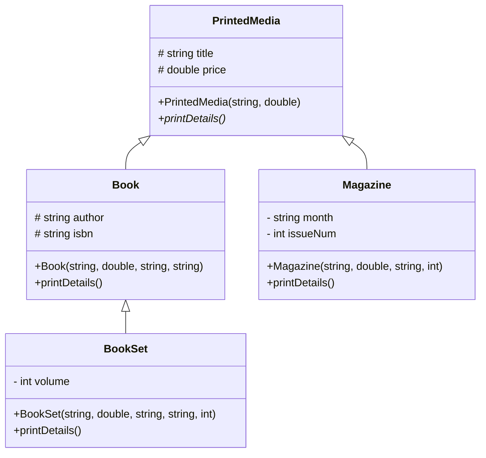

# C++ Inheritance and Polymorphism Lab: BookStore

This lab demonstrates fundamental concepts of object-oriented programming in C++, specifically inheritance and polymorphism, through a simple model of a bookstore inventory system.

## Class Hierarchy

The project is structured around a base class `PrintedMedia` and several derived classes that represent different types of publications.

```
PrintedMedia  <|-- Book
PrintedMedia  <|-- Magazine
       Book   <|-- BookSet
```

### `PrintedMedia`

This is the abstract base class for all printable media in the bookstore.

- It contains protected members for `title` and `price`.
- It declares a pure virtual function `printDetails()`, making it an abstract class. This ensures that any concrete class that inherits from `PrintedMedia` must provide its own implementation of this function.

### `Book`

This class represents a single book.

- It inherits from `PrintedMedia`.
- It adds `author` and `isbn` as protected members.
- It provides a concrete implementation of the `printDetails()` function.

### `Magazine`

This class represents a magazine.

- It inherits from `PrintedMedia`.
- It is intended to have members for the `month` of publication and `issueNum`.
- **Note:** The implementation of `Magazine.h` is incomplete in this project.

### `BookSet`

This class represents a set or collection of books, such as a trilogy or a series.

- It inherits from `Book`, making it a specialized type of book.
- It adds a `volume` member to represent the number of books in the set.
- It overrides the `printDetails()` function to include volume information.

## UML Class Diagram

Here is a UML diagram representing the class relationships:



## Key Concepts Demonstrated

- **Inheritance:** `Book`, `Magazine`, and `BookSet` inherit properties and behaviors from `PrintedMedia` and `Book`.
- **Polymorphism:** The `printDetails()` function is declared as a virtual function in `PrintedMedia` and overridden in the derived classes. This allows for different implementations of the function depending on the object's actual type.
- **Abstract Classes:** `PrintedMedia` is an abstract class because it contains a pure virtual function. This means it cannot be instantiated on its own and serves as a blueprint for its derived classes.
